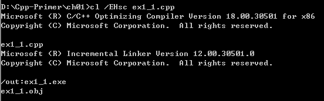
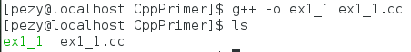

# Chapter 1. Getting Started
##Exercise 1.1
Review the documentation for your compiler and determine what file naming conversion it uses.Compile and run the main program from page2.
###windows

###Linux



##Exercise 1.3
Write a program to print hello,world on the standard outpur.
```cpp
#include <iostream>

int main()
{
	std::cout << "Hello, World"<< std::endl;
    return 0;
}
```
##Exercise 1.4
Our program used the addition operator,+,to add two number.Write a program that uses the multiplication operator,*,to print the product instead.
```cpp
#include <iostream>

int main()
{
	std::cout << "Enter two number:"<<std::endl;
    int v1 = 0, v2 = 0;
    std::cin >> "the product of "<< v1 <<"and"<< v2 <<"is"<< v1 * v2 <<std::endl;
    return 0;
}

```
***
##Exercise 1.5
We wrote the output in one large statement.Rewrite the program to use a separate statement to print each operand.
```cpp
#include <iostream>

int main()
{
	std::cout << "Enter two numbers:" <<std::endl;
    int v1 = 0, v2 = 0;
    std::cin >>  v1 >> v2;
    std::cout << "The product of";
    std::cout << v1;
    std::cout << "and";
    std::cout << v2;
    std::cout << "is";
    std::cout << v1 * v2;
    std::cout << endl;
    
    return 0;
    
}

```

##Exercise 1.6
Explain whether the following program fragment is legal.
<font color = red ,size = 2>
*It's illegal.*
</font>

** [ERROR] expected primary-expresion before '<<' token'**
Fixed it:remove the spare semicolons.
```cpp
std::cout<<"THe sun of" << v1 
		<<"and" << v2
        <<"is"<<v1 + v2 << std::endl;
        
```
hello[^hello]


##[Example 1.9](https://github.com/sooSmile/CppPrime5/blob/master/ch1/ex1_09.cpp)


